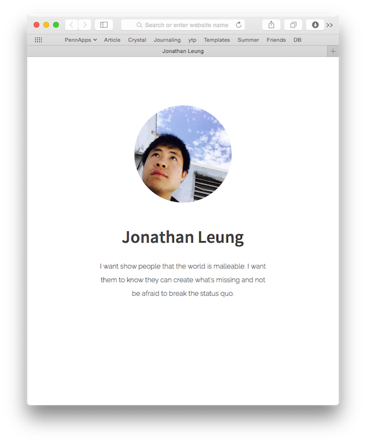

# Creating Your Personal Website!

By the end of this tutorial, you will be building a profile webpage that looks something like this. Here is a 
[live demo](https://rawgit.com/hackedu/hack-camp/20618752b7afa95bbbc5c5ba80c17874ec5e0a35/cohort_4/playbook/workshops/portfolio/src/final_portfolio/index.html).

**We're going to build this in Part 1**

**And in the optional Part 2, we're going to build this**

## Objectives

1. Learn the basics of HTML & CSS TODO- not clear what HTML & CSS are
2. Learn how to use Google to answers to your own questions

## Sections

Do these chronologically:

##### Setting up the workspace
1. [Setting up your workspace](c9_setup.md)

##### Creating the base of the project

1. [Creating your project files](file_creation.md)
1. [Outlining your code](outlining.md)
    1. [Challenge](outlining_challenge.md)
    1. [Solution](outlining_solution.md)

##### Creating the base of your HTML

1. [Adding the name](heading_challenge.md)
1. Adding the description
    1. [Challenge](description_challenge.md)
    1. [Solution](description_solution.md)
1. Adding the image
    1. [Challenge](image_challenge.md)
    1. [Solution](image_solution.md)
1. Adding links
    1. [Challenge](links_challenge.md)
    1. [Solution](links_solution.md)
1. Adding logos
    1. [Challenge](logos_challenge.md)
    1. [Solution](logos_solution.md)

##### Putting your code on the internet
1. [Putting your code on the internet](github.md)

##### Styling your website

1. Adding a title
    1. [Challenge](title_challenge.md)
    1. [Solution](title_solution.md)
1. [Adding styles to your website](add_css.md)
1. Setting font color
1. Centering everything
1. Changing the size of the images
1. Changing the fonts
1. Using Google Web Fonts
1. Creating the sections and adding spacing

1. adding things to the head
    1. title tag

    1. add head > link
    1. this is the first time that we have something we don't want to display on the page, that's why we added to head not body
1. adding & styling body
    1. make all the text the same color
    1. center everything
1. non spacing related things
    1. I do profile picture size
        1. you change social media icon size
    1. I change name
        1. font1.size
        1. font1.family
        1. font1.weight
        1. you change description
            1. font1.size
            1. font1.family
            1. font1.weight
    1. I change google web font
        1. you change google web font
1. then do spacing related things
    1. use the chrome inspector for all of the below
    1. I show constraining width somewhere else
        1. you show constraining width with container
            1. two elements
    1. I show centering a container
        1. you show centering container
    1. creating divs for each section
        1. draw diagram
    1. I show you margin1.top, left, right

