# Setting up your workspace

Just like you may write your English essays in Microsoft Word or Google Docs we will be writing code in Cloud9.

## Open `github.com`
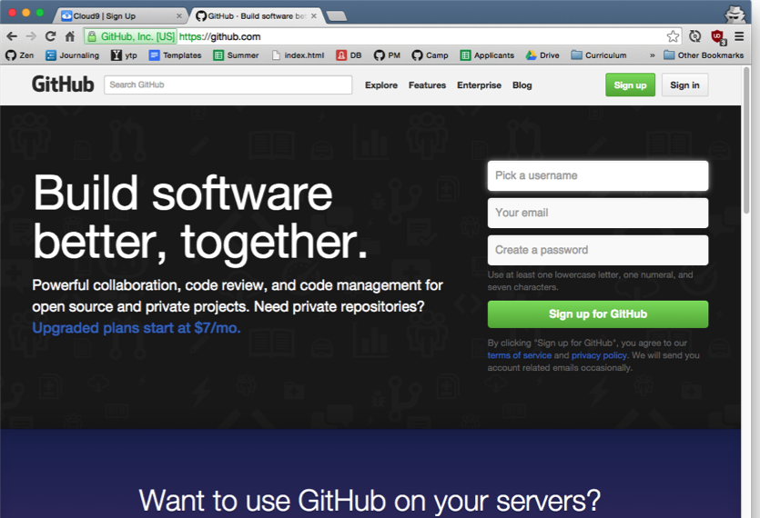

## Create an account with a valid eamil
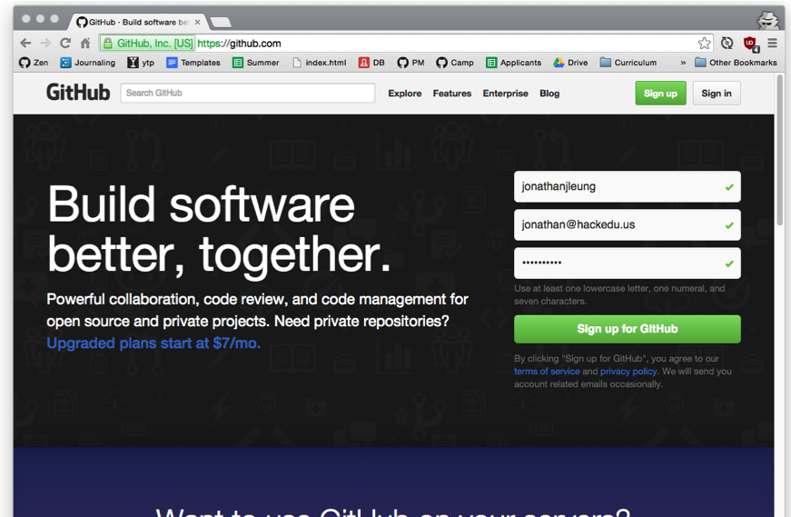

## Click "Sign up for Github"
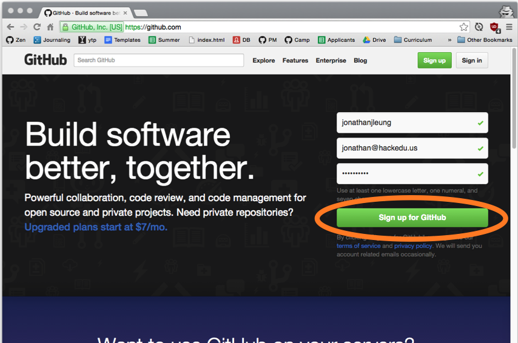

## Validating your Email Address

- Check your email inbox for a confirmation email from github
- Make sure you click on the link it tells you to to confirm your accountl.

> *Important Note*: If you don't do this now, the latter part of this tutorial will not work for you!

## Open `c9.io`
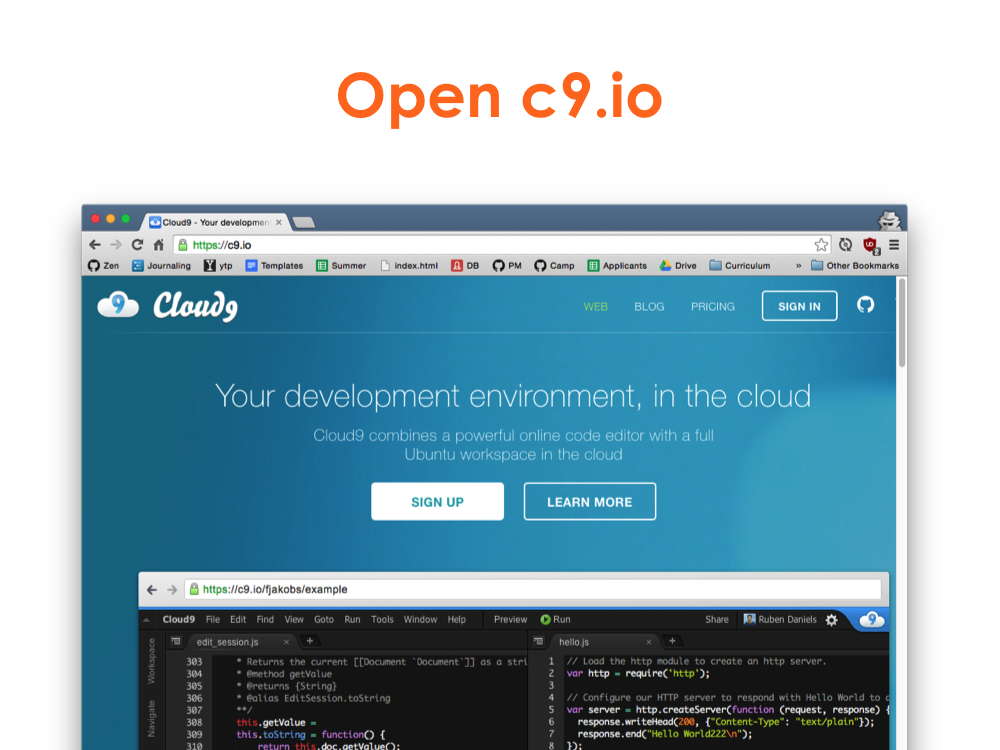

# Click "SIGN UP"
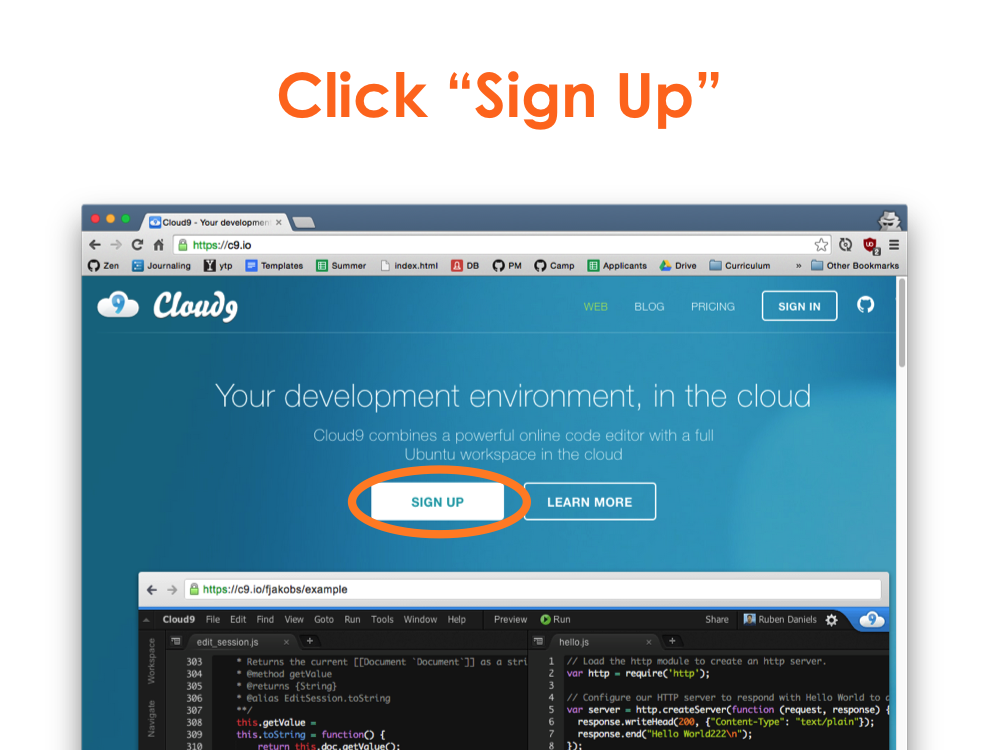

## Click "GitHub"
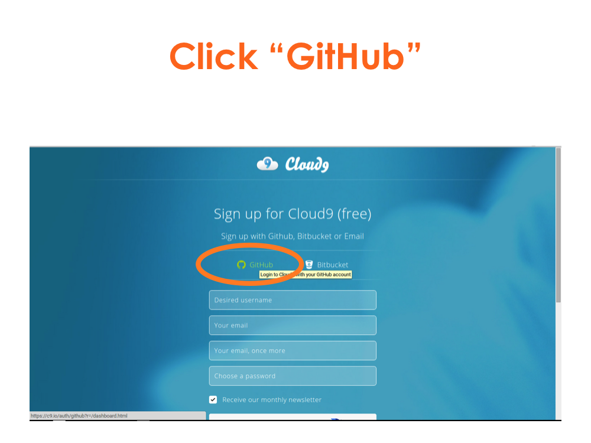

## Sign In with Github
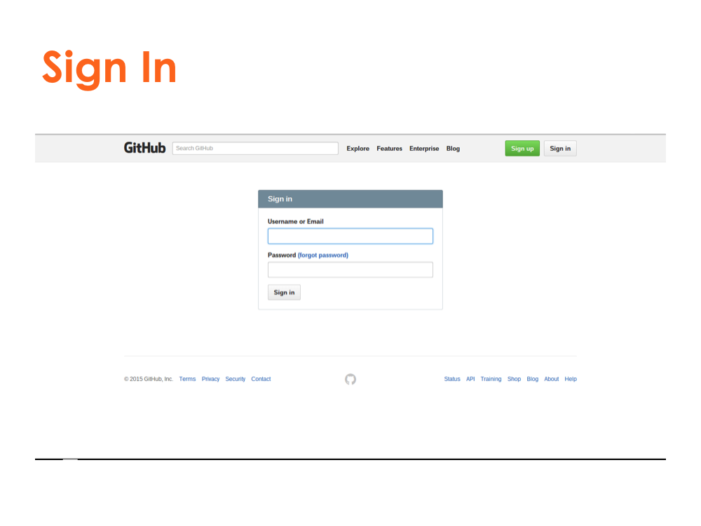

## Click "Dashboard"
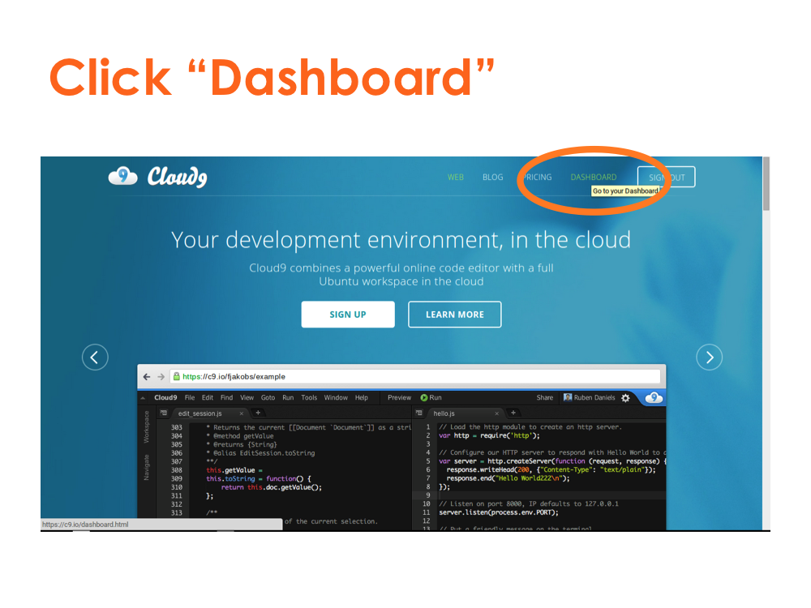

## Click on the "+" button
This creates a new Cloud9 workspace.

## Set the workspace name to `hack-camp`
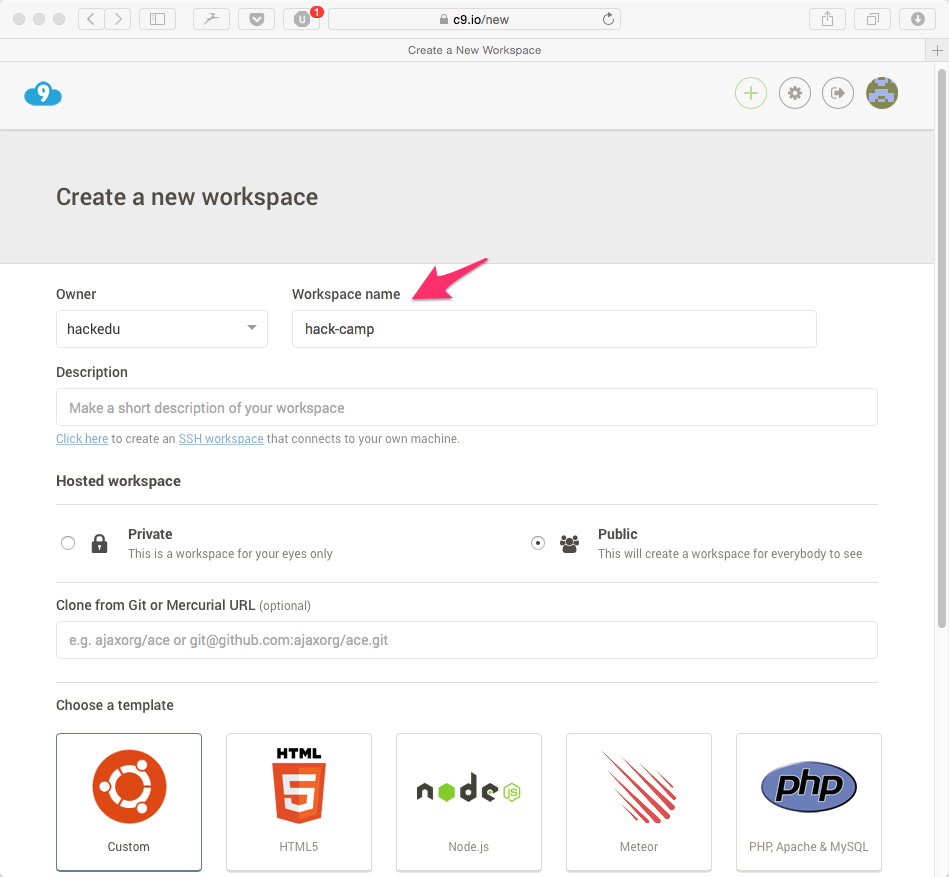

## Click "Custom"


## Click "Create Workspace"
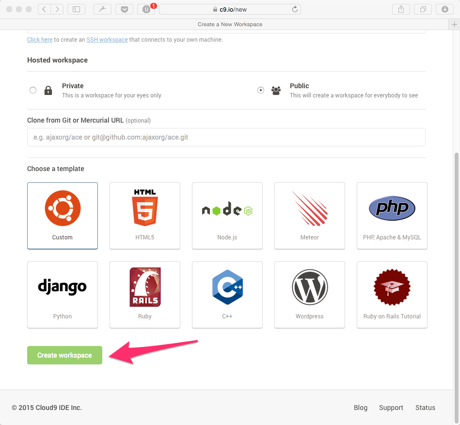

## Scroll Down


## Change `Soft Tabs` to `2`
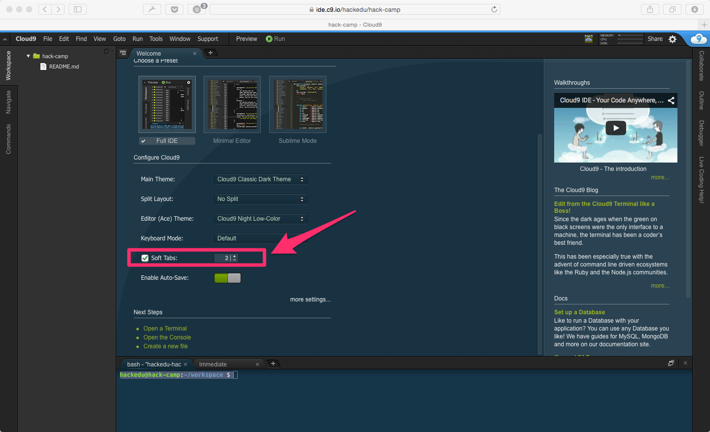

## The Terminal
When we talk about the terminal, this is what we are referring to.

This is another user interface for running commands on the computer.

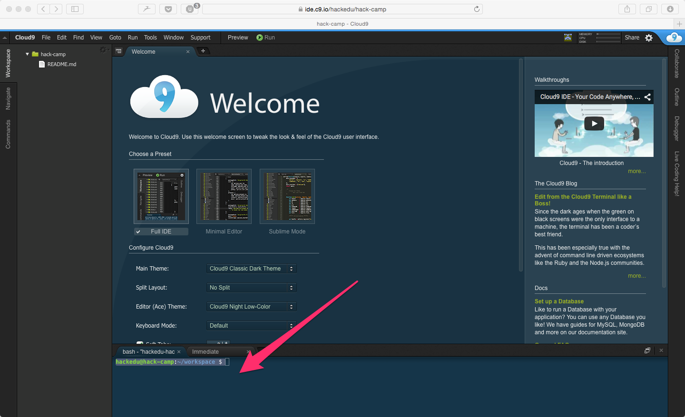

## Start the Server

- Paste the following command into the terminal

    ```
    curl -sL https://git.io/vtbp6 | sudo dd of=/usr/local/bin/live_reload && sudo chmod +x /usr/local/bin/live_reload && live_reload
    ```

- hit `enter`. 

- this may take a few minutes to finish.

## Close the Welcome Tab


## When it's done, your workspace should look like the following:


## Next

Great, now you've finished setting up your Cloud9 workspace!

The next step is to [create the folders and files for your website.](file_creation.md)
