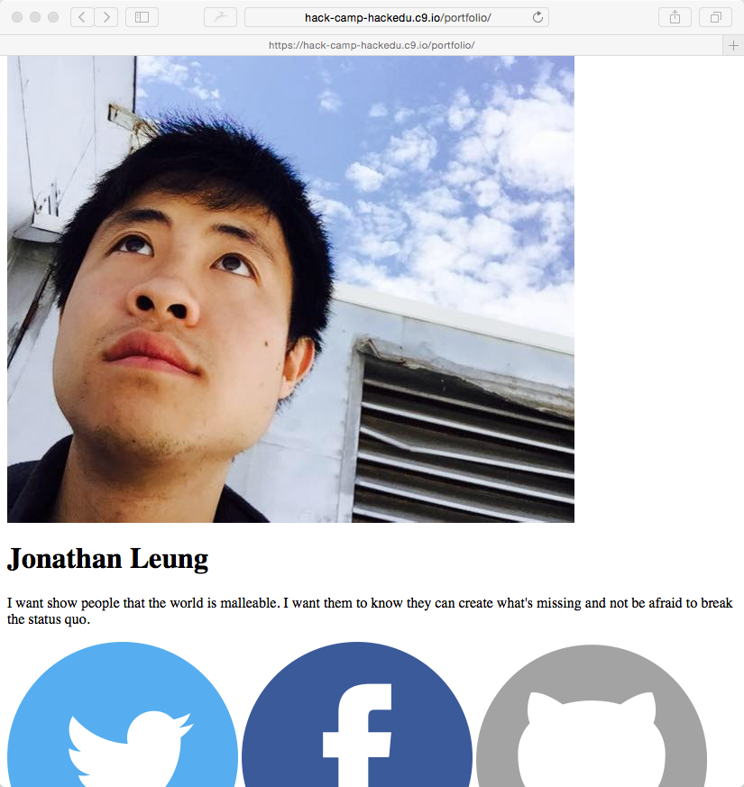

# Challenge: Centering the page

**What we want:**

> 

**What we have:**

> 

In the final version, everything is centered on the page. Currently our content is not centered.

## Challenge

```
Challenge!  
Time        __
           / _)   
    .-^^^-/ /
 __/       /
<__.|_|-|_|

Using CSS, figure out how to center the content of our page
```

## Next

(Centering everything on the page.)[center_solution.md]