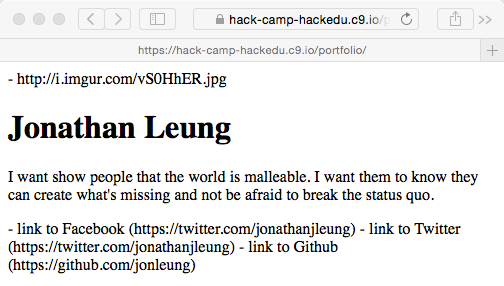

# Description Challenge Solution

To recap: we want to put the description so that it is on it's own line.

> 
> 

I know that one way to do this is with a paragraph tag.

I don't know what a paragraph tag is so I will google it.

## Forming the Google Query

- `how do you add a paragraph tag`
    - Problem: you did not indicate that you wanted to add a header in `html`
- `how do you add a paragraph tag in html`
    - Problem: you get better results if you put the topic in the front
- `html how do you add a paragraph tag`
    - Problem: the words `how do you` and `a` are extraneous. Google doesn't
      really care about them.
- `html add paragraph tag`
    - Problem: I know how to add a tag now, so I just want more information on
      the paragraph tag itself.
- `html paragraph tag`
    - awesome.

## Potential Googling Path

I google `html paragraph tag`
  


[The first result](http://www.w3schools.com/tags/tag_p.asp) is titled `"HTML p
tag - W3Schools"`


On this page, I see that I can use the p tag similarly to the way I used the
`h1` tag:

```html
<p>This is some text in a paragraph</p>
```

I see this that there is a live code demo I can try myself so I immediately
click `"Try it Yourself`.


It seems to tell me that I can use the paragraph tag the same way I used the
`h1` tag.

## Creating the p tag

It seems like now, I can take the text that I have:

```html
- I want show people that the world is malleable. I want them to know they can
  create what's missing and not be afraid to break the status quo.
```

and put it inside of `<p></p>`

```html
<p>I want show people that the world is malleable. I want them to know they can
create what's missing and not be afraid to break the status quo.</p>
```

## After adding the `p` tag to my code:

```html
<!DOCTYPE html>
<html>
  <head>
    <title>Zaphod's Portfolio</title>
  </head>
  <body>
  <!-- PORTFOLIO -->
  
    <!-- IMAGE SECTION -->
      - https://i.imgur.com/vS0HhER.jpg
  
    <!-- INFORMATION SECTION -->
      <h1>Jonathan Leung</h1>
      <!--===========BEGIN_CHANGES===========-->
      <p>I want show people that the world is malleable. I want them to know 
      they can create what's missing and not be afraid to break the status quo.</p>
      <!--============END_CHANGES============-->          

    <!-- SOCIAL MEDIA SECTION -->
      - link to Facebook (https://facebook.com/jonleung137)
      - link to Twitter (https://twitter.com/jonathanjleung)
      - link to Github (https://github.com/jonleung)

  </body>
</html>
```

## Seeing the result

- I make sure that I have clicked on `Preview Running Application`
- I refresh the preview page to see




## Some Vocabulary

- p tag stands for paragraph tag.
- you can write english paragraphs in paragraph tags

```html
<p>This is some text in a paragraph.</p>
^^^ this is called                  ^^^^ this is called
    an opening                           a closing tag
    tag 
```

```html
<p>This is some text in a paragraph.</p>
 ^ this tag is specifically is called an p tag
```

```html
<p>This is some text in a paragraph.</p>
   ^^^^^^^^^^^^^^^^^^^^^^^^^^^^^^^^^ this is called the inner html
```

```html
<p>This is some text in a paragraph</p>
^^^^^^^^^^^^^^^^^^^^^^^^^^^^^^^^^^^^^^^ this entire thing is called an element
```


I notice that the text is starting to shape up now.

## Next

Now we need to figure out [how to add the image](image_challenge.md).
