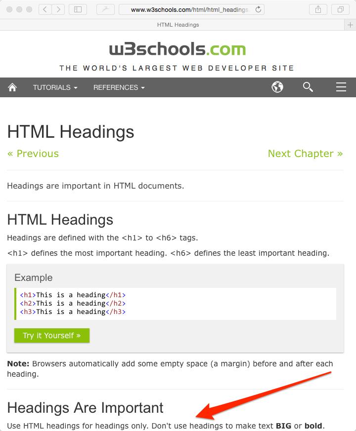

# Adding the name

Let's figure out how to add `Jonathan Leung` in the `INFORMATION SECTION`


## Consulting the Outline

Where should we add this?

Let's consult the outline:

```html
<!-- PORTFOLIO -->

  <!-- IMAGE SECTION -->
    - http://i.imgur.com/vS0HhER.jpg 
  
  <!-- INFORMATION SECTION -->
    - Jonathan Leung <!-- {{ NEXT }} -->            
    - I want show people that the world is malleable. I want them to know they can create what's missing and not be afraid to break the status quo.

  <!-- SOCIAL MEDIA SECTION -->
    - link to Facebook (https://twitter.com/jonathanjleung)
    - link to Twitter (https://twitter.com/jonathanjleung)
    - link to Github (https://github.com/jonleung)
```

```
Pro-tip!

{o,o}
./)_)
  " "

I will add the text `<!-- {{ NEXT }} -->` wheverer I work on next in the code.

See if you can spot it in the above box.

```

## Asking for Help

Ideally you would be able to Google how to do this, but right now we don't even know what to ask Google.

So you might ask a facillitator for help:

```
I want to add some large title text to my page. How do I do that?
```

The facillitator may respond:

```
Use a header! Google will tell you how to use it.
```

Great, I have no idea what a header is, but I know I can Google it.

## Googling

Here are a listing of Google queries sorted from the top down from worst to best.

- `how do you add a header`
    - Problem: you did not indicate that you wanted to add a header in `html`
- `how do you add a header in html`
    - Problem: you get better results if you put the main topic in the front
- `html how do you add a header`
    - Problem: the words `how do you` and `a` are extraneous. Google doesn't really care about them.
- `html add header`
    - Awesome. Let's google it.

## Google Results


[The first result](http://www.w3schools.com/html/html_headings.asp) looks like it talks about headings. Let's open that one.

```md
Pro-tip!

{o,o}
./)_)
  " "

An important note about W3Schools: I would treat it like Wikipedia in 
that it's probably is a good place to get started but its facts are not 
necessarily reliable.
```


Almost always, the first thing I'd try to do is see a working example.

So when I saw this:


## I'd click on it.


This large text on the right seems to be what I want.

So it seems like whatever I want in this large heading, I put between an <hX></hX> where X is a number.

So it seems like I'd do something like:

```html
<h1>Jonathan Leung</h1>
```

## Noting the Warning

I also notice the warning



## Ensuring I understand what a heading is

Because of this warning, I google `html heading` again and click on the first non-w3school result there is.

```
Pro-tip!

{o,o}
./)_)
  " "
developer.mozilla.org or Mozilla Developer Network or MDN is a very reputable source but less beginner friendly than w3 schools.
```

To save time, I won't go through this entire googling process here but in short, I find this


And I realize that a heading is like the heading of a section of a page and that there are headings and sub headings.

## Some Vocabulary

```html
<h1>Jonathan Leung</h1>
^ this is called  ^ this is called
  an opening        a closing tag
  tag 
```

```html
<h1>Jonathan Leung</h1>
 ^ this specifically is called an h1 tag
```

```html
<h1>Jonathan Leung</h1>
    ^^^^^^^^^^^^^^ this is called the inner html
```

```html
<h1>Jonathan Leung</h1>
^^^^^^^^^^^^^^^^^^^^^^^ this entire thing is called an element
```

## Adding the h1 tag to our `index.html` file

```
Note: I will add the text

    <!-- CHANGE -->

on only line that I plan to work on next

```

```html
<!-- PORTFOLIO -->

  <!-- IMAGE SECTION -->
    - http://i.imgur.com/vS0HhER.jpg 
  
  <!-- INFORMATION SECTION -->
    <h1>Jonathan Leung</h1>            <!-- CHANGE -->
    - I want show people that the world is malleable. I want them to know they can create what's missing and not be afraid to break the status quo.

  <!-- SOCIAL MEDIA SECTION -->
    - link to Facebook (https://twitter.com/jonathanjleung)
    - link to Twitter (https://twitter.com/jonathanjleung)
    - link to Github (https://github.com/jonleung)
```


The large text looks right.

## Next

[Adding a description](description_challenge.md)