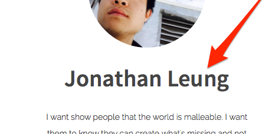
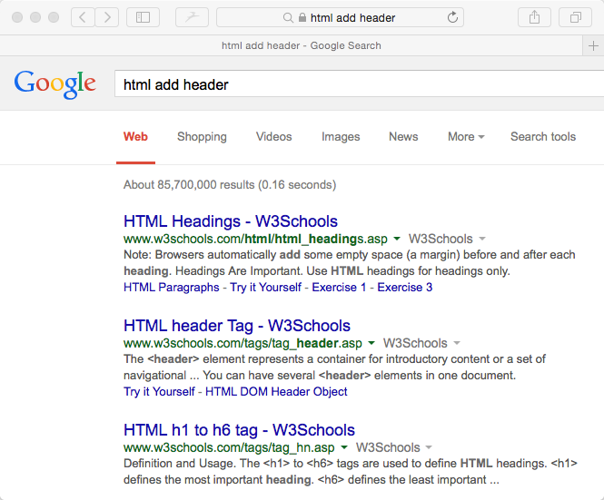
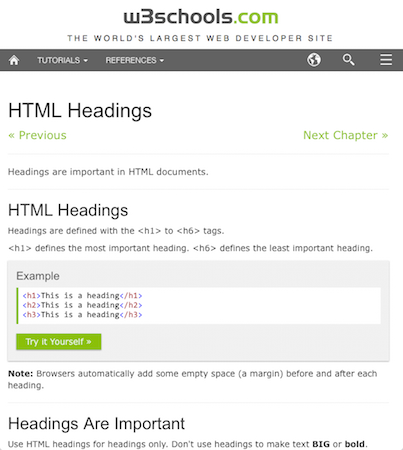
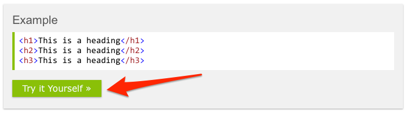
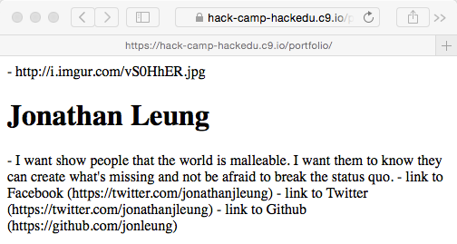

# Formatting Your Name

Let's figure out how to format your name so that it looks like this:



## Looking at the Outline

Let's take a look to see where we are and where we want to make our changes.

This is what you should have right now:

```html
<!DOCTYPE html>
<html>
  <head>
    <title>Zaphod's Portfolio</title>
  </head>
  <body>
    <!-- PORTFOLIO -->

      <!-- IMAGE SECTION -->
        - https://i.imgur.com/vS0HhER.jpg
      
      <!-- INFORMATION SECTION -->
        - Jonathan Leung <!-- {{ NEXT }} -->            
        - I want show people that the world is malleable. I want them to know they can create what's missing and not be afraid to break the status quo.

      <!-- SOCIAL MEDIA SECTION -->
        - link to Facebook (https://facebook.com/jonleung137)
        - link to Twitter (https://twitter.com/jonathanjleung)
        - link to Github (https://github.com/jonleung)
  </body>
</html>
```

```
Pro-tip!

{o,o}
./)_)
  " "

I will add the text `<!-- {{ NEXT }} -->` wheverer I work on next in the code.

See if you can spot it in the above box.
```

## Asking for Help

Ideally you would be able to Google how to add this name, but right now we might now even know how.

So you might ask a facillitator for help:

```
I want to add some large title text to my page. How do I do that?
```

The facillitator may respond:

```
Use a header! Google will tell you how to use it.
```

Great, I have no idea what a header is, but I know I can Google it.

## Googling

Here are some possible search queries starting with the worst and ending with the best.

Read each of the google queries and their associated problems until you get to the best one at the bottom (so that you can optimize your searches too).

- `how do you add a header`
    - Problem: you did not indicate that you wanted to add a header in `html`
- `how do you add a header in html`
    - Problem: you get better results if you put the main topic in the front
- `html how do you add a header`
    - Problem: the words `how do you` and `a` are extraneous. Google doesn't really care about them.
- `html add header`
    - Awesome. Let's google it.

## Google Results



[The first result](http://www.w3schools.com/html/html_headings.asp) looks like it talks about headings. Let's open that one.



When I'm trying to figure out how to do something, if there is a code example for me to try, that's almost always the first thing I do on the page.

So when I saw this, I immediately click on it



## When I click on it

[This page](http://www.w3schools.com/html/tryit.asp?filename=tryhtml_headings) comes up:


This seems promising because it seems like what we're looking for. Right now you could be thinking to yourself "heading 1 looks like the same size and format as what I wanted. Let me try testing this in my code to see what happens."

The example tells me this:

```html
<h1>This is heading 1</h1>
```

So if I want my name there, it seems like I might want this:

```html
<h1>Jonathan Leung</h1>
```

Next, lets try adding this the code!

```md
Pro-tip!

{o,o}
./)_)
  " "

An important note about W3Schools: I would treat it like Wikipedia; it's
probably is a good place to get started (it is very beginner friendly) but its
facts are not necessarily reliable.

Sometimes their recommendations do not follow best practice or are sometimes
just completely wrong.

If you're not sure about something, check another source like Mozilla Developer
Networks (which is a very reliable source but is a lot less beginner friendly).
```

## Adding the h1 tag to our `index.html` file

```md
Note: in this and subsequent snippets of code, I will add the text

    <!-- CHANGE -->

on or pointing to the line that has been modified
```

```html
<!DOCTYPE html>
<html>
  <head>
    <title>Zaphod's Portfolio</title>
  </head>
  <body>
    <!-- PORTFOLIO -->

      <!-- IMAGE SECTION -->
        - https://i.imgur.com/vS0HhER.jpg
      
      <!-- INFORMATION SECTION -->
        <!--===========BEGIN_CHANGES===========-->
        <h1>Jonathan Leung</h1> 
        <!--============END_CHANGES============-->          
        - I want show people that the world is malleable. I want them to know they can create what's missing and not be afraid to break the status quo.

      <!-- SOCIAL MEDIA SECTION -->
        - link to Facebook (https://facebook.com/jonleung137)
        - link to Twitter (https://twitter.com/jonathanjleung)
        - link to Github (https://github.com/jonleung)
  </body>
</html>
```

## Click "Preview Running Application" again



The name looks right!


## Some Vocabulary

(so that you know how to talk and think about what we just did)

```html
<h1>Jonathan Leung</h1>
^^^^ this is called
     an opening tag         
  
```

```html
<h1>Jonathan Leung</h1>
                  ^^^^^ this is called
                        a closing tag
  
```

```html
<h1>Jonathan Leung</h1>
^^^^ this specifically is called an h1 tag
```

```html
<h1>Jonathan Leung</h1>
    ^^^^^^^^^^^^^^ this is called the inner html
```

```html
<h1>Jonathan Leung</h1>
^^^^^^^^^^^^^^^^^^^^^^^ this entire thing is called an element
```

## Next

[Adding a description](description_challenge.md)
