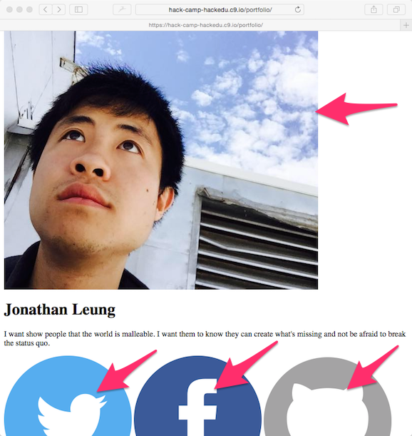

# Challenge: Resizing the image

**What we want:**

> 

**What we have:**

> 

One of the biggest problems is that the images are WAY TOO LARGE.

Lets see if we can make it smaller.

## Challenge

```
Challenge!  
Time        __
           / _)   
    .-^^^-/ /
 __/       /
<__.|_|-|_|

How can we change the size of the images?

Note that because we are changing how the image "looks", the solution lies in CSS.

IMPORTANT: To save time and to limit frustration, spend 3 minutes trying figure out how to do this. If you havn't found what you wanted after 3 minutes just advance to the next page and we'll walk you through it!
```

## Next

[Resizing the image](image_resize_solution.md)