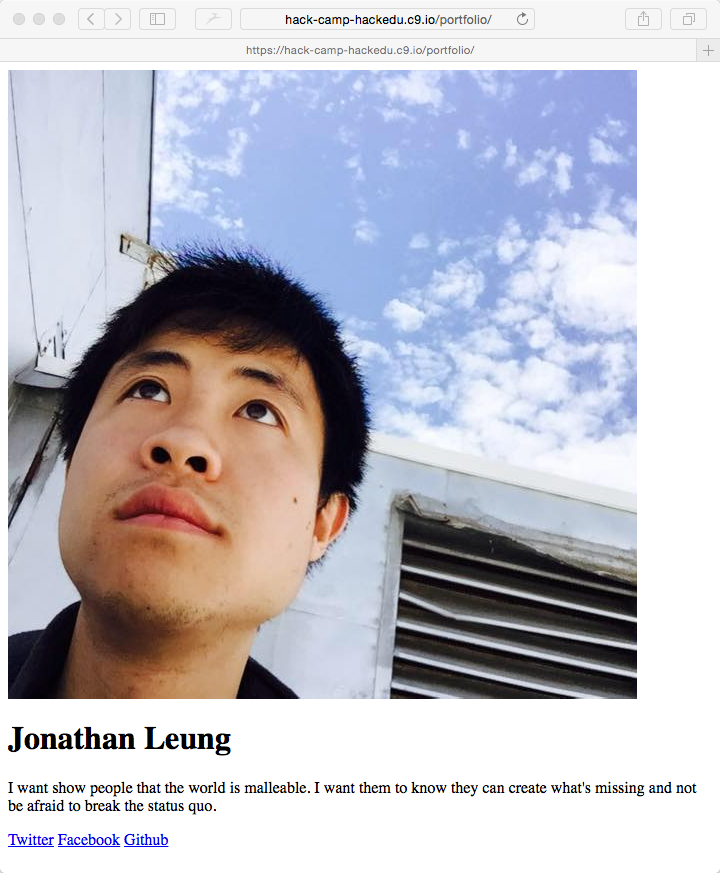

# Image Challenge Solution

## Prompt

```html
<!-- PORTFOLIO -->

  <!-- IMAGE SECTION -->
    - http://i.imgur.com/vS0HhER.jpg
  
  <!-- INFORMATION SECTION -->
    <h1>Jonathan Leung</h1>
    <p>I want show people that the world is malleable. 
       I want them to know they can create what's missing
       and not be afraid to break the status quo.</p> 
    
  <!-- SOCIAL MEDIA SECTION -->
    - link to Facebook (https://twitter.com/jonathanjleung)
    - link to Twitter (https://twitter.com/jonathanjleung)
    - link to Github (https://github.com/jonleung)
    <!-- ^ NEXT -->
```
## How I Googled

- I googled `html links`
- opened the [first w3schools page](http://www.w3schools.com/html/html_links.asp)
- I tried [the example](http://www.w3schools.com/html/tryit.asp?filename=tryhtml_links_w3schools)
  - It seemed like this tag was responsible for adding the link to the page: `<a href="http://www.w3schools.com/html/">Visit our HTML tutorial</a>`

- I learn from the w3 schools page
  > - "The href attribute specifies the destination address (`http://www.w3schools.com/html/`)

## The Solution

So it seems like I do something like this:

```html
<a href="https://twitter.com/jonathanjleung">Twitter</a>
```

And if I have 3 links:

```html
<a href="https://twitter.com/jonathanjleung">Twitter</a>
<a href="https://facebook.com/jonleung137">Facebook</a>
<a href="https://github.com/jonleung">Github</a>
```

## Some Vocabulary

```html
<a href="https://twitter.com/jonathanjleung">Twitter</a>
 ^ "a" is the tag name
```

```html
<a href="https://twitter.com/jonathanjleung">Twitter</a>
 ^ this is the opening tag                                ^ this is the
                                                            closing tag

(Note that the a tag does have a closing tag)
```

```html
<a href="https://twitter.com/jonathanjleung">Twitter</a>
                                             ^^^^^^^^^^^
This is the inner html.
It is text that is actually displayed on the screen.
```

```html
<a href="https://twitter.com/jonathanjleung">Twitter</a>
   ^^^^^^^^^^^^^^^^^^^^^^^^^^^^^^^^^^^^^^^^^ this is an attribute
                                             of the a tag

     (think of attributes like settings)
```

```html
<a href="https://twitter.com/jonathanjleung">Twitter</a>
   ^^^^ "href" is the name of this attribute
```

```html
<a href="https://twitter.com/jonathanjleung">Twitter</a>
         ^^^^^^^^^^^^^^^^^^^^^^^^^^^^^^^^^^ 
         "https://twitter.com/jonathanjleung"
         is the value of the "href" attribute
```

```html
<a href="https://twitter.com/jonathanjleung">Twitter</a>

The "href" attribute actually sets the place the user 
is taken to if they click on the link.
```

## Solution

```html
<!-- PORTFOLIO -->

  <!-- IMAGE SECTION -->
    
  
  <!-- INFORMATION SECTION -->
    <h1>Jonathan Leung</h1>
    <p>I want show people that the world is malleable. 
       I want them to know they can create what's missing
       and not be afraid to break the status quo.</p> 
    
  <!-- SOCIAL MEDIA SECTION -->
    <a href="https://twitter.com/jonathanjleung">Twitter</a>
    <a href="https://facebook.com/jonleung137">Facebook</a>
    <a href="https://github.com/jonleung">Github</a>

    <!-- ^ SOLUTION -->
```



Yay! Now it seems that the links actually take me to the page!

## Next

Instead of writing the text `Twitter`, `Facebook`, or `Github`
I instead want their logos.

[Adding logos](logos_challenge.md)