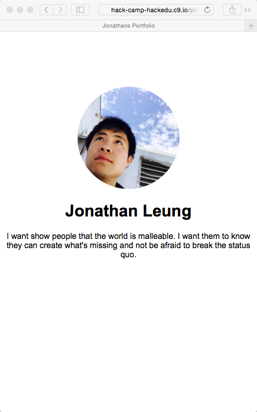

# Solution: Using margins to adjust elements

To recap, we want to move the picture downwards, because currently it is too
high up.

## Googling the solution

- I google `css margin`

  > 

- I open the first result:
  [CSS Margin - W3Schools](http://www.w3schools.com/css/css_margin.asp)
- It says that: `The margin clears an area around an element.`
- We can assume that this margin will be able to clear space at the top of the
  page, so the picture will be moved downwards.

  We see:

  > 

- We also see that there are four types of margins: top, bottom, right, and
  left, but since we're only shifting the picture downwards, we can assume we
  would use `margin-top`.

So it seems like I add this into the CSS:

```html
margin-top: (someNumber)px;
```

## Adding this snippet to my CSS

> 

## The Result

- I make sure I have clicked on `Preview Running Application`
- I refresh the preview page to see: 

> 

## Finish!

