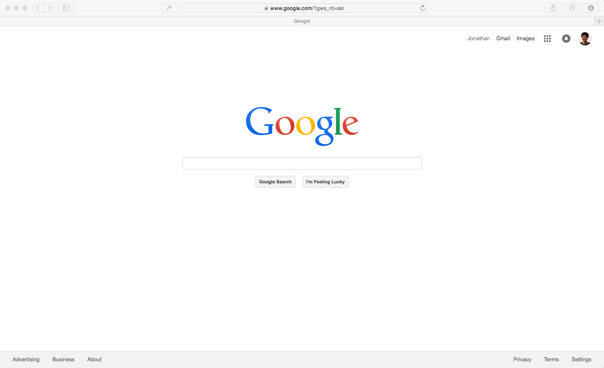

# Outlining your code

## Reviewing Our Objective

Our objective is to make this:


## Laying Out the Structure

The first thing that Jonathan personally does when making a website sketching out the structure of the website.

Jonathan does this by making a bulleted point list.

## Example: Laying out Google.com

Let's say Jonathan was trying to rebuild the html of `google.com`

Before he even starts coding, Jonathan lays out the sections of the website



## Google's Main Sections


## Then he will outline it as a bulleted point list

```
- Google
    - Top Navigation Sections
    - Main Search Sections
    - Bottom Navigation Section
```

## Sub Components

Then for each section, he'd add each of the sub-components:


## Outlining The Subcomponents

```
- Google
    - Top Navigation Sections
        - Jonathan
        - Gmail
        - Images
        - Apps Logo
        - Notifications Icon
        - Profile
    - Main Search Sections
        - Google Logo
        - Search Bar
        - Google Search
        - I'm Feeling Lucky
    - Bottom Navigation Section
        - Advertising
        - Business
        - About
        - Privacy
        - Terms
        - Settings
```

## Next

[I challenge you to outline the portfolio website.](outlining_challenge.md)