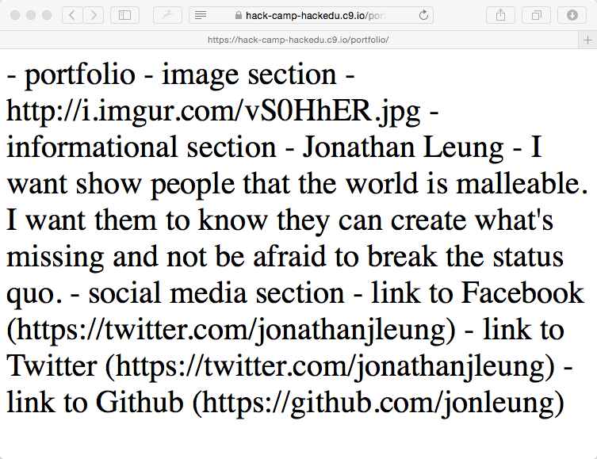
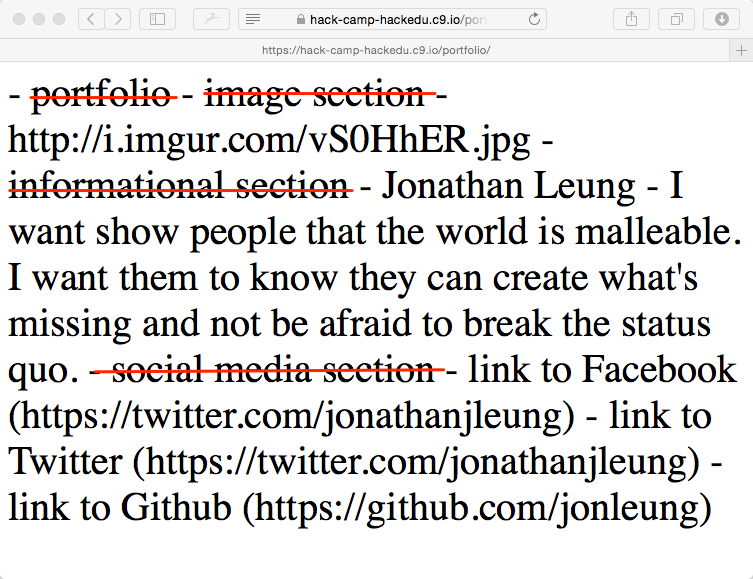
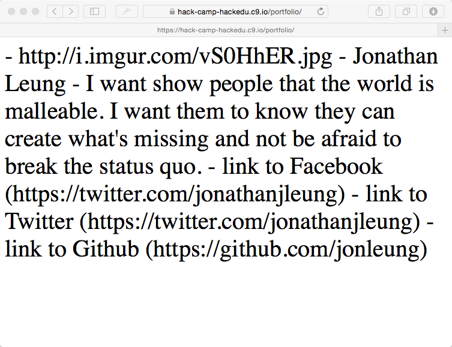

# Solution: Outlining your code

Note that there are many ways to outline this. This is just one potential solution.

## One Potential Solution


```
<!DOCTYPE html>
<html>
  <head>
    <title>Zaphod's Portfolio</title>
  </head>
  <body>
    - portfolio
      - image section
        - image
      - informational section
        - Jonathan
        - description
      - social media section
        - link to Facebook
        - link to Twitter
        - link to Github
  </body>
</html>
```


## Update Your Description

Although the way you did it could have been completely "right", just for the sake of this tutorial, please update yours to match the above.

## Filling In the names

We can start to replace the outline with our own custom information. For example:
- `"name"` with `"Jonathan Leung"` and
- `"description"` with `"I want to show..."`

**Feel free to fill this in with your own information or you can also use mine**

```html
<!DOCTYPE html>
<html>
  <head>
    <title>Zaphod's Portfolio</title>
  </head>
  <body>
    - portfolio
      - image section
        - https://i.imgur.com/vS0HhER.jpg
      - informational section
        - Jonathan Leung
        - I want show people that the world is malleable. I want them to know they can create what's missing and not be afraid to break the status quo.
      - social media section
        - link to Facebook (https://facebook.com/jonleung137)
        - link to Twitter (https://twitter.com/jonathanjleung)
        - link to Github (https://github.com/jonleung)
  </body>
</html>

```

## Placeholding

We are using the above outline as a placeholders for our code that will soon be written. Throughout this tutorial, we will be replacing each bullet point with real HTML code.

## Previewing our work

Just like before,

- click `Preview`
- then click `Preview Running Application`

## The Result


The above certainly looks weird. That's because right now we just have an outline.

The first thing to make this look closer to our actual website though, is to hide the bullet points we don't want in the final website to show up as text.

For example, `image section` and `informational section` for instance should not be displayed.

## Things To Be Removed



## Leaving Comments

When any text is surrounded by the charachters, i.e. `<!-- text -->` the text will only be visible in the code and not on the site.

This is called a comment.

It is useful:

- to leave notes to yourself or your teammates
- or to keep the names of your scaffolding

## Our New Outline

(which now has all of those section titles removed)

```html
<!DOCTYPE html>
<html>
  <head>
    <title>Zaphod's Portfolio</title>
  </head>
  <body>
    <!-- PORTFOLIO -->

      <!-- IMAGE SECTION -->
        - https://i.imgur.com/vS0HhER.jpg
      
      <!-- INFORMATION SECTION -->
        - Jonathan Leung
        - I want show people that the world is malleable. I want them to know they can create what's missing and not be afraid to break the status quo.

      <!-- SOCIAL MEDIA SECTION -->
        - link to Facebook (https://facebook.com/jonleung137)
        - link to Twitter (https://twitter.com/jonathanjleung)
        - link to Github (https://github.com/jonleung)
  </body>
</html>
```

## Preview



## Focusing on Part 1

For the upcomming sections, we're just going to focus on Part 1. 

_TODO: Link final screenshot 0_

Part 2 is optional can be done at home at your liesure.


## Next

[A bit more information about the structure of this tutorial](tutorial_format.md)
