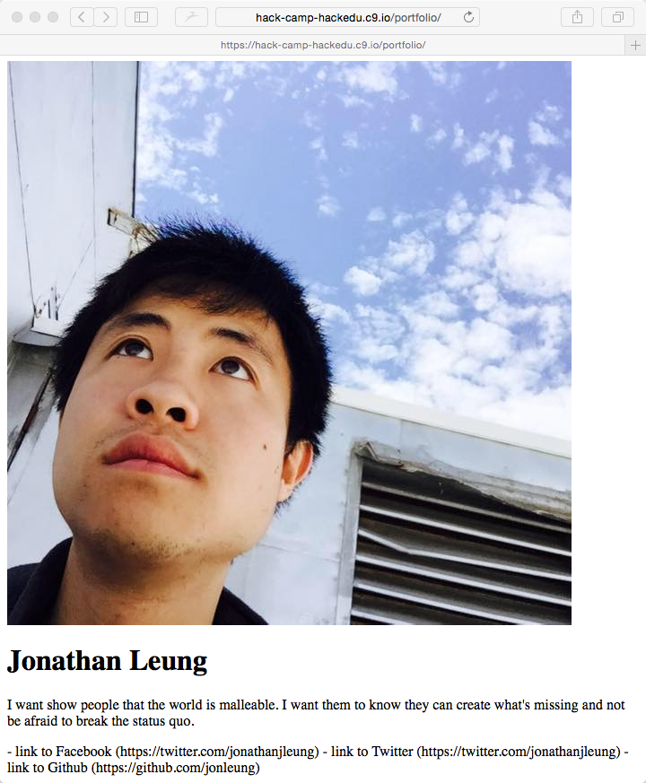

# Solution: Centering the page

To recap, we want to center everything that is on the page.

I would initially try to break down this problem into smaller problems.

Perhaps we could think about

- centering the 

## Googling the solution

<!TODO Bullet Points>

## Making my own <!TODO>

<!TODO>

```css

```

## Adding it to my code

<!TODO>

## Seeing the result

<!TODO>

- I make sure that I have clicked on `Preview Running Application`
- I refresh the preview page to see:

> 


# Some Vocabulary

<!TODO>

## Next

<!TODO>